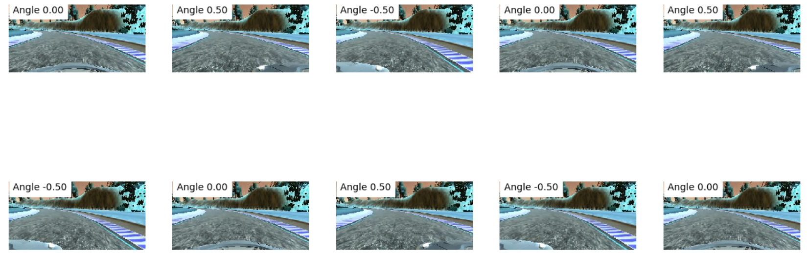
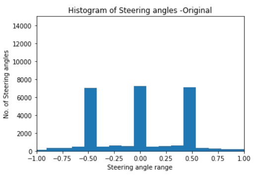
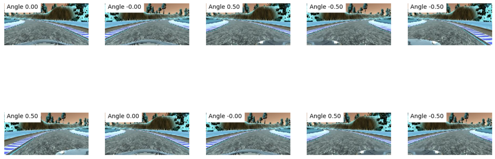
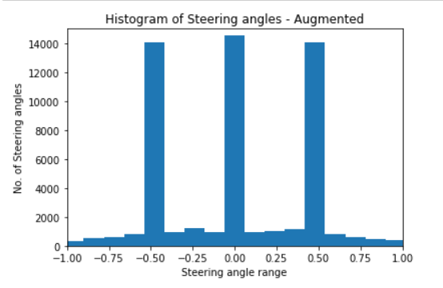
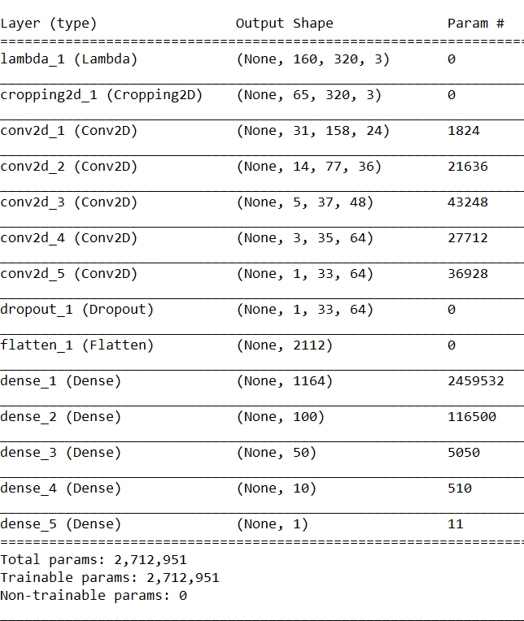

# **Behavioral Cloning** 

The goals / steps of this project are the following:
* Use the simulator to collect data of good driving behavior
* Build, a convolution neural network in Keras that predicts steering angles from images
* Train and validate the model with a training and validation set
* Test that the model successfully drives around track one without leaving the road
* Summarize the results with a written report  

My github repo for this project : [project code](https://github.com/amundada2310/CarND-Behavioral-Cloning-P3)

### Files Submitted & Code Quality

#### 1. Submission includes all required files and can be used to run the simulator in autonomous mode

My project includes the following files:
* model_try.py containing the script to create and train the model.
* model_try.h5 containing a trained convolution neural network.
* run_try.mp4 video recording of your vehicle driving autonomously at least one lap around the track.
* 'newdata_try' data used to train the model.
* writeup_report.md summarizing the results.

#### 2. Submission includes functional code
Using the Udacity provided simulator and my drive.py file, the car can be driven autonomously around the track by executing 
```sh
python drive.py model_try.h5
```

#### 3. Submission code is usable and readable

The model_try.py file contains the code for training and saving the convolution neural network. The file shows the pipeline I used for training and validating the model, and it contains comments to explain how the code works.

### Model Architecture and Training Strategy

#### 1. An appropriate model architecture has been employed 

1. My final CNN model was implemented using the NVIDIA architecture.


#### 2. Attempts to reduce overfitting in the model

1. I impletmented the dropout layer after the convolutional layers to avoid overfitting. 

2. The model was trained and validated on different data sets to ensure that the model was performing well. The data-set was developed in a such a way that car was intenstionally driven on the left and right sides of the road and the navigation from the sides to center lane was recorded. This was done in order to train the model how to perform in such situation. 
Additional submission with different data set. Below are the submission details for the same-
2.1 model.py containing the script to create and train the model.
2.2 model.h5 containing a trained convolution neural network.
2.3 run.mp4 video recording of vehicle driving autonomously at least one lap around the track.
2.4 'new_data1' data used to train the model.

3. The model was tested by running it through the simulator and ensuring that the vehicle could stay on the track. 

#### 3. Model parameter tuning

The model used an adam optimizer, so the learning rate was not tuned manually.

#### 4. Appropriate training data

1. Training data was chosen to keep the vehicle driving on the road. I used a combination of center lane driving, recovering from the left and right sides of the road.
2. My training data consisted of -
  2.1 Two forward laps
  2.2 One reverse lap data
3. I utilized the data from all 3 center, left as well as right cameras.
4. The images taken from left and right camera were added with a correction factor 0.5 to the steering angles. Below are few original data images from center, left and right camera:



5. I also plotted the histogram of the original data images:



6. The images were then augmented in order to avoid the car drifting towards one side. This helped the model to generalize better. Below are few augmented data images from center, left and right camera:



7. I also plotted the histogram of the augmented data images:




### Model Architecture and Training Strategy

#### 1. Solution Design Approach

1. I followed the steps discussed in the lectures and implemented the NVIDIA architecture as discussed above.

2. I split my image and steering angle data into a training (80%) and validation set (20%). I found that my first model had a low mean squared error on the training set but a high mean squared error on the validation set. 

3. The final step was to run the simulator to see how well the car was driving around track one. There were a few spots where the vehicle fell off the track.

4. In order to improve the driving behavior, I added an addtitional 1164 dense layer, and played with the epoch values. Also, in order to combat the overfitting, I modified the model added the dropout layer.

5. My final implemedted model  -
  5.1 Normalized the incoming image by adding a lambda layer in which we divide the each element by 255 (max value of a pixel) and normalized the whole between 0 - 1 and then subtracted 0.5 to mean center the image.
  5.2 Cropped the image normalized image removed top 70 pixels and botton 25 pixels.
  5.3 1st convolutional layer with filter size 5X5, and 2X2 strides, with Relu activation
  5.4 2nd convolutional layer with filter size 5X5, and 2X2 strides, with Relu activation
  5.5 3rd convolutional layer with filter size 5X5, and 2X2 strides, with Relu activation
  5.6 4th convolutional layer with filter size 3x3, with Relu activation
  5.7 5th convolutional layer with filter size 3x3, with Relu activation
  5.8 Dropout layer added in-order to help overfitting. 60% keep probability was set in this case.
  5.9 Flattened layer added.
  5.10 1st Fully connected layer, with 1164 neurons, with Relu activation
  5.11 2nd Fully connected layer, with 100 neurons, with Relu activation
  5.12 3rd Fully connected layer, with 50 neurons, with Relu activation
  5.13 4th Fully connected layer, with 10 neurons, with Relu activation
  5.14 5th Fully connected layer, with 1 neuron, linear activation.
  5.16 Compiled the model and used mean squared error to determine the loss function. 

6. My Final developed CNN model is as below:



7. Below is the implement for CNN model:
 
`from keras.models import Sequential
from keras.layers import Flatten, Dense, Lambda, Activation, Cropping2D
from keras.layers.convolutional import Conv2D
from keras.layers.pooling import MaxPooling2D
from keras.layers import Dropout

model = Sequential()
model.add(Lambda(lambda x: (x / 255.0) - 0.5, input_shape = (160,320,3)))
model.add(Cropping2D(cropping=((70,25), (0,0))))

model.add(Conv2D(24, (5,5), subsample = (2,2), activation = 'relu'))
model.add(Conv2D(36, (5,5), subsample = (2,2), activation = 'relu'))
model.add(Conv2D(48, (5,5), subsample = (2,2), activation = 'relu'))
model.add(Conv2D(64, (3,3), activation = 'relu'))
model.add(Conv2D(64, (3,3), activation = 'relu'))

model.add(Dropout(0.6))
model.add(Flatten())
model.add(Dense(1164,activation = 'relu'))

model.add(Dense(100,activation = 'relu'))
model.add(Dense(50,activation = 'relu'))
model.add(Dense(10,activation = 'relu'))
model.add(Dense(1))

model.summary()      

model.compile(loss='mse',optimizer='adam')
history_object = model.fit(X_train,y_train,validation_split=0.2,shuffle=True, nb_epoch=3, verbose=1)
model.save('model_try.h5')`

9. I also, trained the same model with various data sets, second submission details are as descried above.

8. At the end of the process, the vehicle is able to drive autonomously around the track without leaving the road.
[Video](https://github.com/amundada2310/CarND-Behavioral-Cloning-P3/blob/master/output_video/run_try.mp4)

#### 2. Final Model Architecture

Discussed Above.

#### 3. Creation of the Training Set & Training Process

Discussed Above.
